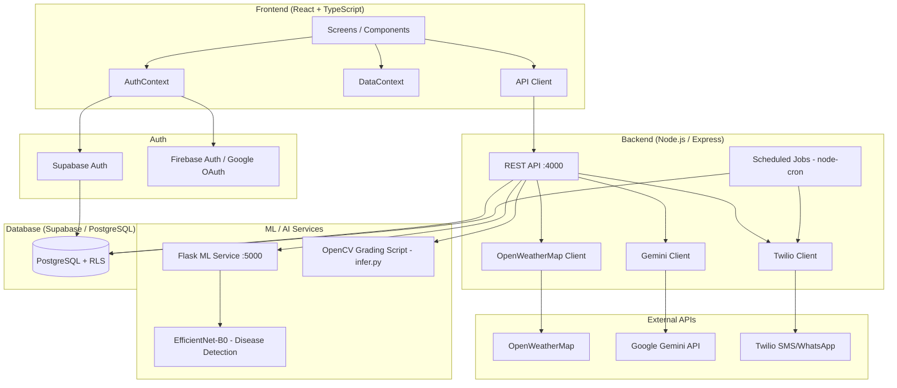

# AnnaVriddhi — Farm Revenue Copilot

> Real-time crop intelligence for Indian farmers — AI-powered advisory, grading, disease detection, government schemes, and revenue planning in one platform.

AnnaVriddhi addresses a critical gap in Indian agriculture: most smallholder farmers make high-stakes decisions (when to harvest, how much to irrigate, which government benefits to claim) without access to timely, data-driven guidance. This platform aggregates crop health data, soil sensor readings, weather forecasts, and ML predictions into a single dashboard, then delivers actionable recommendations and alerts to farmers via web app, SMS, or WhatsApp.

---

## Table of Contents

1. [Key Features](#key-features)
2. [System Architecture](#system-architecture)
3. [Tech Stack](#tech-stack)
4. [Project Structure](#project-structure)
5. [AI / ML Components](#ai--ml-components)
6. [Backend APIs](#backend-apis)
7. [Database Schema](#database-schema)
8. [Authentication](#authentication)
9. [Local Setup](#local-setup)
10. [Environment Variables](#environment-variables)
11. [API / Service Configuration](#api--service-configuration)
12. [Feature Flows](#feature-flows)
13. [Alerts System](#alerts-system)
14. [Government Schemes](#government-schemes)
15. [Demo Account](#demo-account)
16. [Production Considerations](#production-considerations)
17. [Future Improvements](#future-improvements)
18. [License](#license)

---

## Key Features

### Dashboard
A real-time overview screen showing crop health score (0–100), soil moisture, temperature, rain forecast, disease risk, and the top AI-generated recommendation. Quick links navigate to Grading, Schemes, Irrigation, and Season Review. Data is presented via gauge bars and stat tiles. Currently renders with hardcoded/mock data for the demo account; real data flows from Supabase when a connected crop is present.

### Crop Condition
Displays daily crop health data — health score, soil moisture percentage, disease risk percentage, nitrogen level, canopy cover, soil pH, soil EC, and canopy temperature. Data is stored in the `crop_health_daily` table. Trends over 7 days are visualised.

### AI Recommendations
Recommendations are stored per crop in the `recommendations` table with types (`irrigation`, `fertilizer`, `pesticide`, `harvest`, `scheme`), priority levels (`high`, `medium`, `low`), predicted revenue impact in INR, and action deadlines. The `recommendationService` fetches them; farmers can acknowledge or dismiss via the API.

### Irrigation
Backend exposes a schedule API per crop that is designed to integrate soil moisture sensor data and OpenWeatherMap forecasts. The frontend screen visualises upcoming irrigation needs. Irrigation events can be logged (date, amount in mm, method). The service layer is present but sensor + weather integration is marked as a `TODO` pending live sensor feeds.

### Disease Detection
A two-model pipeline:
- **Leaf/crop disease detection** — EfficientNet-B0 trained on the PlantVillage dataset (38 classes), served via a Flask HTTP service at port 5000. The Node backend calls the Python service, maps the class name to disease info, runs a risk assessment via `diseaseFlaggerService`, and returns symptoms, treatment, prevention, and organic remedy knowledge.
- **Produce quality grading** — A separate RGB-based OpenCV grading model (see Grading below).

Image uploads are accepted as multipart `image` fields. The `DISEASE_MODEL_PROVIDER` env variable switches between `python` (live model), `mock` (for development), and potentially `onnx`.

### Crop Grading / Quality Detection
A custom Python script (`backend/grading/scripts/infer.py`) grades produce using classical computer vision (OpenCV + NumPy) — no neural net required. Supports **tomato, banana, potato, and onion**.

Pipeline per image:
1. GrabCut foreground segmentation (fallback: center-crop mask)
2. Per-channel HSV analysis for color ripeness
3. Edge density + variance analysis for surface defect scoring
4. Contour circularity for shape scoring
5. Brightness + saturation uniformity for freshness scoring
6. Weighted composite → **Grade A / B / C** with quality score 0–100

Results include subscores (`color_ripeness`, `surface_defect`, `shape`, `freshness`) and human-readable notes. The backend `gradingService` currently returns stubs; the Python `infer.py` script is the functional grading implementation and is designed to be invoked by the backend.

### Grading History
A dedicated screen showing past grading events per crop, powered by the `grading_events` and `produce_grades` tables. The API provides `GET /api/grading/:cropId/history` and `GET /api/grading/:cropId/latest`.

### Harvest Window
The `harvestWindowService` computes an optimal harvest window by combining maturity scoring, weather safety, and price trends. Results are stored in the `harvest_plans` table with recommended start/end dates, window score, expected revenue, and risk-if-delayed estimate.

### Government Scheme Finder
A scheme matching system with **9 pre-verified schemes** (central and state-level) seeded from official government sources. Matching is done by state, crop, activity, farmer category, and land size. The backend provides:
- `GET /api/schemes/match` — profile-based matching with eligibility scoring
- `GET /api/schemes/state/:state` — all schemes for a state
- `GET /api/schemes/category/:category` — schemes by category

The frontend Schemes screen displays matched schemes with benefit values, deadlines, eligibility status, document checklists, and application URLs. Schemes currently use static seed data from `schemeSeedData.js`; a Supabase `government_schemes` table with 5 seeded records is also present.

### Farmer Alerts
A persistent, farmer-specific alert system stored in the `farmer_alerts` table. Alert types include: `npk_nitrogen`, `npk_phosphorus`, `npk_potassium`, `irrigation`, `pest`, `disease`, `storm`, `general`. Each alert has severity (`low`, `medium`, `high`), read/unread state, expiry, and optional crop linkage. The API supports listing, filtering, marking individual or all alerts as read, and manually triggering alert evaluation. The alert job scans crop health data and crop state snapshots to generate threshold-based alerts.

### Revenue Summary
The `revenueService` calculates:
- **Gross revenue** = expected yield (kg) × market price per kg
- **Net revenue** = gross − input costs + scheme benefits
- **Profit margin %** = net / gross × 100
- **Crop state score** = weighted composite of soil moisture, leaf color, pest pressure, and growth stage

The frontend RevenueSummary screen renders this data. The `002_add_revenue_pct_and_advisor.sql` migration adds `revenue_pct` and advisor columns to extend the schema.

### Season Review / Crop Wrapped
The `cropWrappedService` generates a personalised seasonal report per crop including recommendation adherence, disease summary, financial comparison, and insights. The frontend SeasonReview screen renders this. Farmer actions on recommendations are tracked via the `farmer_actions` table (logged by `POST /api/crop-wrapped/actions`).

### AI Chatbot (Agri Advisor)
An in-app conversational AI advisor powered by **Google Gemini 1.5 Flash**. The system prompt positions it as an expert Indian agricultural advisor that:
- Responds in Hindi, English, or Hinglish based on the farmer's language
- Uses only actual farm context for specific numbers (never invents data)
- Includes crop data, health scores, recent recommendations, latest grade, and eligible schemes in the context prompt
- Maintains a rolling conversation history per farmer (last 3 exchanges)
- Falls back gracefully when the API key is not configured

Exposed via `POST /api/advisor/:farmerId` with a `message` body field. Conversation history can be cleared via `DELETE /api/advisor/:farmerId/history`.

### Decision Engine
A Gemini-backed decision engine (`decisionEngine.js` + `geminiService.js`) that generates comprehensive farm decisions and can localize them to target languages (Hindi, Marathi, Telugu, Tamil, Kannada, Punjabi, Bengali, and more). Exposed via:
- `POST /api/decisions/generate`
- `GET /api/decisions/dashboard/:farmId`
- `POST /api/decisions/localize`
- `POST /api/decisions/message` — generates SMS/WhatsApp message from a decision

### SMS / WhatsApp Notifications
High-priority alerts and recommendations can be dispatched via SMS and WhatsApp using the **Twilio** integration (`smsWhatsapp.js`). The `alertJob` is designed to scan pending high-priority recommendations and send them. Incoming SMS/WhatsApp replies from farmers are handled via a webhook (`POST /api/recommendations/webhook/sms-reply`).

### Messages Inbox
The `messages` table stores in-app notifications linked to crops and recommendations. The Messages screen displays unread message counts and a full inbox view.

### Sensor Ingest
`sensorIngest.js` is the entry point for IoT sensor data (soil moisture, NPK, temperature). Sensor readings are stored in the `sensor_readings` table with reading type, value, unit, optimal range, and status.

### Offline / Sync Status
The `sync_log` table tracks offline sync state. The Offline screen surfaces pending sync items for low-connectivity environments.

### Settings
Per-farmer user settings (language preference, notification channel, alert thresholds, theme) are stored in `user_settings` and auto-created by a Supabase trigger on farmer creation.

### Help
A static help/FAQ screen for farmers.

---

## System Architecture



**Data flow summary:**
- The React frontend authenticates via Supabase Auth (email/password) or Firebase (Google OAuth)
- Authenticated requests include a `X-Farmer-ID` header for farmer-scoped data
- The Express backend handles all business logic, calls external APIs, and reads/writes to Supabase/PostgreSQL
- Disease detection images are forwarded from the Node backend to the Flask Python service
- Crop grading runs the Python `infer.py` script as a subprocess (or equivalent)
- `node-cron` scheduled jobs run crop state computation and alert evaluation on a configurable schedule (default: every 6 hours)

---

## Tech Stack

| Layer | Technology |
|-------|-----------|
| **Frontend framework** | React 19, TypeScript 5, Vite 8 |
| **Styling** | Custom design tokens (CSS-in-JS inline styles), Tailwind CSS 4 |
| **Database** | Supabase (PostgreSQL) with Row-Level Security |
| **Auth** | Supabase Auth (email/password) + Firebase Auth (Google OAuth) |
| **Backend** | Node.js, Express 4, CommonJS |
| **AI/LLM** | Google Gemini 1.5 Flash (`@google/generative-ai`) |
| **Disease ML** | PyTorch + EfficientNet-B0 (transfer learning from ImageNet) |
| **Grading ML** | OpenCV + NumPy (classical computer vision, no neural net) |
| **ML serving** | Flask + flask-cors |
| **SMS/WhatsApp** | Twilio |
| **Weather** | OpenWeatherMap API |
| **Image handling** | multer (Node), sharp, Pillow, OpenCV (Python) |
| **Job scheduling** | node-cron |
| **Frontend deploy** | Firebase Hosting |
| **HTTP security** | helmet, cors |
| **Request logging** | morgan |
| **Input validation** | express-validator |
| **Testing** | Jest (backend unit tests) |

---

## Project Structure

```
farm-revenue-copilot/
├── frontend/                      # React TypeScript SPA
│   ├── src/
│   │   ├── api/                   # API client modules (alerts, grading, disease, irrigation, etc.)
│   │   ├── components/            # Reusable UI components (Card, Gauge, Btn, Badge, etc.)
│   │   ├── contexts/
│   │   │   ├── AuthContext.tsx    # Auth state — Supabase + Firebase, demo account
│   │   │   ├── DataContext.tsx    # Global data provider for authenticated app
│   │   │   └── AlertsContext.tsx  # Alert polling and unread count
│   │   ├── lib/
│   │   │   ├── supabase.ts        # Supabase client + all TypeScript type definitions
│   │   │   └── firebase.ts        # Firebase app + Google auth provider
│   │   ├── mocks/                 # Static mock data for demo account
│   │   ├── screens/               # One file per screen/feature
│   │   ├── services/
│   │   │   ├── demoDataService.ts # Demo account credentials + mock data loader
│   │   │   └── supabaseService.ts # Supabase data access helpers
│   │   ├── tokens.ts              # Design tokens (colours, radii, shadows, screen names)
│   │   └── App.tsx                # Root — AuthProvider, routing, Sidebar, AppLayout
│   ├── index.html
│   ├── vite.config.ts
│   └── package.json
│
├── backend/                       # Node.js / Express API
│   ├── src/
│   │   ├── config/
│   │   │   ├── cropMaturity.js       # Crop maturity stage data
│   │   │   ├── cropWaterRequirements.js # Water needs per crop
│   │   │   ├── diseaseClasses.js     # PlantVillage class → crop/disease mapping
│   │   │   ├── diseaseKnowledge.js   # Treatment/prevention knowledge base
│   │   │   └── fertilizerReference.js # Fertilizer types and dosage reference
│   │   ├── integrations/
│   │   │   ├── geminiClient.js       # Gemini API wrapper + system prompt
│   │   │   ├── sensorIngest.js       # IoT sensor data ingestion
│   │   │   ├── shcLookup.js          # Soil Health Card API lookup
│   │   │   ├── smsWhatsapp.js        # Twilio SMS/WhatsApp wrapper
│   │   │   └── weatherApi.js         # OpenWeatherMap wrapper
│   │   ├── jobs/
│   │   │   ├── alertJob.js           # Sends high-priority alerts via SMS
│   │   │   ├── cropStateJob.js       # Computes crop state snapshots
│   │   │   ├── scheduler.js          # node-cron scheduler init
│   │   │   └── test*.js              # Manual test runners for each job
│   │   ├── middleware/
│   │   │   └── auth.js               # JWT / farmer-ID auth middleware
│   │   ├── models/
│   │   │   ├── db.js                 # PostgreSQL client (pg)
│   │   │   ├── dbSupabase.js         # Supabase JS client for backend
│   │   │   ├── schema.sql            # PostgreSQL schema (legacy/local dev)
│   │   │   └── schemeSeedData.js     # 9 verified government schemes
│   │   ├── routes/                   # Express route handlers (see API table)
│   │   ├── services/                 # Business logic layer
│   │   └── index.js                  # Express app entry point
│   ├── grading/
│   │   └── scripts/
│   │       └── infer.py              # OpenCV produce quality grading
│   ├── ml/
│   │   ├── model.py                  # EfficientNet-B0 architecture
│   │   ├── train.py                  # Two-stage training pipeline
│   │   ├── inference.py              # DiseasePredictor class + CLI
│   │   ├── serve_model.py            # Flask HTTP server for inference
│   │   ├── config.py                 # Training hyperparameters + paths
│   │   ├── dataset.py                # PlantVillage dataset loader
│   │   └── requirements.txt          # Python dependencies
│   ├── migrations/
│   │   ├── 002_add_revenue_pct_and_advisor.sql
│   │   └── 003_farmer_alerts.sql     # farmer_alerts table + NPK columns
│   ├── supabase/
│   │   └── migrations/
│   │       └── 001_init_schema.sql   # Full Supabase schema (20+ tables)
│   ├── data/                         # PlantVillage dataset (not committed)
│   ├── models/                       # Trained model checkpoints (not committed)
│   └── package.json
│
├── shared/
│   └── types/                        # Shared TypeScript types
├── scripts/
│   └── seed-demo-data.js             # Seed script for demo data
└── docs/
    ├── api-contract.md
    ├── Farm_Revenue_Copilot_Spec.md
    └── Farm_Revenue_Copilot_UI_Spec.md
```

---

## AI / ML Components

### 1. Disease Detection Model (EfficientNet-B0)

| Property | Detail |
|----------|--------|
| **Architecture** | EfficientNet-B0 with custom classifier head |
| **Dataset** | PlantVillage (38 disease/healthy classes) |
| **Input** | 224×224 RGB images, ImageNet normalisation |
| **Output** | Class name + confidence (softmax probability) |
| **Classes** | Tomato, Apple, Grape, Potato, Corn, Pepper, Cherry, Peach, Strawberry, Squash, Raspberry, Soybean (healthy + disease variants) |
| **Training** | Two-stage: Stage 1 — freeze feature extractor, train classifier head (15 epochs, LR 0.001). Stage 2 — unfreeze last 50 layers, fine-tune (20 epochs, LR 0.0001) |
| **Optimiser** | AdamW, weight decay 0.01, cosine LR scheduler |
| **Serving** | Flask HTTP server (`serve_model.py`) on port 5000 |
| **Integration** | Node backend POSTs image buffer to `DISEASE_MODEL_URL/predict`, receives `{class, confidence, crop, disease, healthy}` |

**Confidence thresholds:**
- ≥ 80% → High confidence
- 60–80% → Medium confidence  
- < 60% → Low confidence (flagged for manual review)

### 2. Produce Quality Grading (OpenCV + NumPy)

| Property | Detail |
|----------|--------|
| **File** | `backend/grading/scripts/infer.py` |
| **Supported crops** | Tomato, Banana, Potato, Onion |
| **Method** | Classical computer vision (no neural network) |
| **Segmentation** | GrabCut foreground extraction (fallback: center-crop mask) |
| **Features** | HSV color ripeness, edge density (surface defects), contour circularity (shape), brightness + saturation uniformity (freshness) |
| **Output** | Grade (A/B/C), quality score (0–100), subscores per dimension, human-readable notes |
| **Per-crop config** | Ideal hue range, saturation minimum, weight per dimension, grade thresholds |

**Grade thresholds (example for tomato):**
- A: ≥ 78 composite score
- B: 58–77
- C: < 58

### 3. AI Advisory (Google Gemini 1.5 Flash)

- Model: `gemini-1.5-flash` via `@google/generative-ai`
- System prompt includes: role definition, language rules (Hindi/English/Hinglish), and strict instruction to use only provided context for farm-specific numbers
- Context injected per query: crop details, health scores, last 3 recommendations, latest grade, up to 3 eligible schemes
- Rolling 3-exchange conversation history maintained per farmer in memory
- Fallback: Graceful Hindi + English error message when API key is absent or quota exceeded

---

## Backend APIs

| Method | Endpoint | Purpose |
|--------|----------|---------|
| `GET` | `/health` | Server health check |
| `GET` | `/api/irrigation/:cropId` | Get irrigation schedule and current water balance |
| `GET` | `/api/irrigation/:cropId/schedule` | Legacy alias for above |
| `POST` | `/api/irrigation/:cropId` | Log an irrigation event (`amountMm`, `method`, `date`, `notes`) |
| `POST` | `/api/irrigation/:cropId/log` | Legacy alias for above |
| `POST` | `/api/grading` | Grade produce — multipart `image` + `crop` (tomato/banana/potato/onion) + optional `cropId`, `notes` |
| `GET` | `/api/grading/:cropId/latest` | Latest grading result for a crop |
| `GET` | `/api/grading/:cropId/history` | Full grading history for a crop |
| `GET` | `/api/schemes/match` | Match schemes to farmer profile (`state`, `crop`, `landSize`, `activity`, etc.) |
| `GET` | `/api/schemes/state/:state` | All schemes available in a state |
| `GET` | `/api/schemes/category/:category` | Schemes by category |
| `GET` | `/api/schemes/:schemeId` | Single scheme detail |
| `GET` | `/api/recommendations/:cropId` | All recommendations for a crop |
| `POST` | `/api/recommendations/:id/acknowledge` | Acknowledge/act on a recommendation |
| `POST` | `/api/recommendations/webhook/sms-reply` | Twilio incoming SMS/WhatsApp webhook |
| `POST` | `/api/disease/detect` | Detect disease — multipart `image` + optional `cropId` |
| `GET` | `/api/disease/supported-classes` | List all supported disease classes |
| `GET` | `/api/disease/health` | Disease service availability check |
| `POST` | `/api/advisor/:farmerId` | Ask the AI advisor a question (`{ message }`) |
| `DELETE` | `/api/advisor/:farmerId/history` | Clear AI conversation history |
| `GET` | `/api/advisor/health` | AI advisor availability check |
| `GET` | `/api/alerts` | Farmer alerts (header `X-Farmer-ID`, supports `limit`, `offset`, `unread`, `type`) |
| `GET` | `/api/alerts/unread-count` | Unread alert count |
| `PATCH` | `/api/alerts/:id/read` | Mark one alert as read |
| `PATCH` | `/api/alerts/read-all` | Mark all alerts as read |
| `POST` | `/api/alerts/evaluate` | Manually trigger alert evaluation |
| `POST` | `/api/decisions/generate` | Generate farm decisions via Gemini |
| `GET` | `/api/decisions/dashboard/:farmId` | Dashboard overview decisions |
| `POST` | `/api/decisions/localize` | Localize decisions to a language |
| `POST` | `/api/decisions/message` | Generate SMS/WhatsApp message from decision |
| `GET` | `/api/decisions/languages` | List supported localization languages |
| `GET` | `/api/crop-wrapped/:cropId` | Crop Wrapped seasonal report (auth required) |
| `POST` | `/api/crop-wrapped/actions` | Log farmer action on a recommendation |
| `GET` | `/api/crop-wrapped/farmer/:farmerId/seasons` | List all seasons for a farmer |
| `GET` | `/api/webhooks` | Twilio and external webhooks |

---

## Database Schema

The Supabase schema (`001_init_schema.sql`) defines 20 tables with Row-Level Security (RLS) enabled on all of them. Every policy ensures farmers can only read/write their own data.

### Core Tables

| Table | Purpose | Key Columns |
|-------|---------|-------------|
| `farmers` | Farmer profile | `id`, `auth_user_id` (Firebase UID or Supabase UUID), `name`, `phone`, `state`, `district`, `village`, `total_area_acres`, `preferred_language` |
| `plots` | Farm fields/plots | `id`, `farmer_id`, `name`, `area_acres`, `soil_type`, `location_lat`, `location_lng` |
| `crops` | Crop seasons per plot | `id`, `plot_id`, `crop_name`, `variety`, `planted_date`, `expected_harvest_date`, `current_stage`, `health_status` |
| `sensor_readings` | IoT sensor data | `crop_id`, `sensor_id`, `reading_type`, `value`, `unit`, `optimal_range`, `status`, `recorded_at` |
| `crop_health_daily` | Aggregated daily health metrics | `crop_id`, `date`, `health_score`, `moisture_pct`, `disease_risk_pct`, `nitrogen_level`, `canopy_cover_pct`, `soil_ph`, `soil_ec` |
| `recommendations` | AI/rule-based farm actions | `crop_id`, `farmer_id`, `type`, `priority`, `title`, `body`, `why_now`, `predicted_revenue_impact`, `status`, `deadline_date` |
| `alerts` | Supabase-side alerts | `farmer_id`, `crop_id`, `alert_type`, `severity`, `title`, `recommended_action`, `status` |
| `farmer_alerts` | Backend PostgreSQL alerts | `farmer_id`, `crop_id`, `type`, `severity`, `title`, `message`, `data` (JSONB), `is_read`, `expires_at` |
| `produce_grades` | Grading results | `crop_id`, `grade`, `quality_score`, `color_ripeness_score`, `surface_quality_score`, `market_price_per_unit`, `batch_revenue` |
| `government_schemes` | Seeded scheme catalogue | `scheme_name`, `category`, `benefit_description`, `benefit_amount`, `eligibility_criteria`, `state_specific` |
| `farmer_scheme_applications` | Farmer's scheme tracking | `farmer_id`, `scheme_id`, `application_status`, `estimated_benefit`, `actual_benefit` |
| `harvest_plans` | Harvest window predictions | `crop_id`, `recommended_harvest_start_date`, `window_score`, `maturity_score`, `expected_total_revenue`, `risk_if_delayed` |
| `seasons` | Seasonal summaries | `farmer_id`, `season_name`, `total_revenue_added`, `recommendations_followed`, `recommendations_skipped`, `average_produce_grade` |
| `season_reviews` | Season insights | `season_id`, `review_type`, `title`, `revenue_impact` |
| `messages` | In-app message inbox | `farmer_id`, `message_type`, `channel`, `is_read`, `related_crop_id` |
| `field_scans` | Disease/nutrient scans | `crop_id`, `scan_type`, `image_url`, `analysis_result` (JSONB), `ml_model_used` |
| `fertilizer_applications` | Fertilizer logs | `crop_id`, `fertilizer_type`, `dose_per_acre`, `application_date`, `cost` |
| `weather_forecast` | Stored weather data | `plot_id`, `forecast_date`, `temp_min`, `temp_max`, `rainfall_mm`, `humidity_pct` |
| `activity_log` | Farm event timeline | `farmer_id`, `crop_id`, `event_type`, `event_title`, `impact_revenue`, `event_date` |
| `user_settings` | Per-farmer settings | `farmer_id`, `preferred_language`, `notification_enabled`, `notification_channel`, `theme` |
| `sync_log` | Offline sync tracking | `farmer_id`, `table_name`, `record_id`, `status` |

### Relationships
```
farmers (1) ──< plots (many)
plots (1) ──< crops (many)
crops (1) ──< sensor_readings / crop_health_daily / recommendations /
              produce_grades / field_scans / fertilizer_applications /
              harvest_plans / weather_forecast (all FK: crop_id)
farmers (1) ──< alerts / farmer_alerts / messages / seasons /
                farmer_scheme_applications / activity_log / user_settings
government_schemes (1) ──< farmer_scheme_applications (many)
seasons (1) ──< season_reviews (many)
```

### Triggers & Functions
- `create_user_settings_on_farmer_creation` — auto-creates `user_settings` row on farmer insert
- `update_updated_at_column` — auto-updates `updated_at` on all major tables

---

## Authentication

The app supports two authentication providers, managed in `AuthContext.tsx`:

**Supabase Auth (primary — email/password)**
- Sign-in calls `supabase.auth.signInWithPassword`
- On success, `loadFarmerData` fetches the farmer row from Supabase by `auth_user_id`
- Supabase RLS policies ensure all data access is scoped to the authenticated user
- Session is persisted and auto-refreshed by the Supabase JS client

**Firebase Auth (Google OAuth)**
- Sign-in via `signInWithPopup` with Google provider
- Firebase user is synced to Supabase: if a `farmers` row with the Firebase UID exists it is loaded; otherwise a new farmer row is created
- Supabase-compatible user object is constructed from the Firebase user for app-wide consistency

**Farmer ID propagation**
- After sign-in the `farmer.id` is stored in `localStorage` under key `farmer_id`
- Backend API routes that need farmer context read `X-Farmer-ID` header or `farmer_id` query param
- The frontend API client attaches this header automatically

**Demo Account**
> ⚠️ For evaluation only — not connected to any real database

| Field | Value |
|-------|-------|
| Email | `demo@123` |
| Password | `123` |

The demo account bypasses Supabase entirely. `isDemoAccount()` intercepts the sign-in, sets a synthetic user object, and loads all data from the `frontend/src/mocks/` folder. The `is_demo_account` flag in `localStorage` prevents the Supabase auth state listener from clearing the session.

---

## Local Setup

### Prerequisites

- Node.js ≥ 18
- Python ≥ 3.10
- A Supabase project (free tier works)
- A Firebase project (for Google OAuth — optional)
- Git

### 1. Clone the repository

```bash
git clone <repo-url>
cd farm-revenue-copilot
```

### 2. Frontend setup

```bash
cd frontend
cp .env.example .env
# Fill in VITE_SUPABASE_URL, VITE_SUPABASE_ANON_KEY, and Firebase keys in .env
npm install
```

### 3. Backend setup

```bash
cd backend
cp .env.example .env
# Fill in GEMINI_API_KEY, WEATHER_API_KEY, TWILIO_*, SUPABASE_URL, SUPABASE_SERVICE_ROLE_KEY
npm install
```

### 4. Database (Supabase)

1. Create a new project at [supabase.com](https://supabase.com)
2. In the SQL Editor, run the full schema:
   ```
   backend/supabase/migrations/001_init_schema.sql
   ```
3. Run additional migrations in order:
   ```
   backend/migrations/002_add_revenue_pct_and_advisor.sql
   backend/migrations/003_farmer_alerts.sql
   ```
4. Copy your project URL and `anon` key to `frontend/.env` and the `service_role` key to `backend/.env`

> See `backend/SUPABASE_SETUP.md` for detailed Supabase configuration steps.

### 5. Disease Detection ML service (optional)

Only required if you want live disease detection. Skip this for demo mode.

```bash
cd backend/ml
pip install -r requirements.txt
```

You need a trained model checkpoint. Either:
- Train from scratch (requires PlantVillage dataset in `backend/data/PlantVillage/`):
  ```bash
  python train.py
  ```
- Or place a pre-trained checkpoint at `backend/models/disease/disease_efficientnet_b0_best.pth`

Then start the Flask service:
```bash
python serve_model.py --host 127.0.0.1 --port 5000
```

Set `DISEASE_MODEL_URL=http://127.0.0.1:5000/predict` and `DISEASE_MODEL_PROVIDER=python` in `backend/.env`.

For development without the model, set `DISEASE_MODEL_PROVIDER=mock`.

### 6. Produce Grading Python dependencies (optional)

```bash
pip install opencv-python numpy
```

The `backend/grading/scripts/infer.py` script is invoked with `--image`, `--crop`, and `--json` flags.

### 7. Start the backend

```bash
cd backend
npm run dev        # Development (nodemon, auto-restart)
# or
npm start          # Production
```

Backend runs on `http://localhost:4000`.

### 8. Start the frontend

```bash
cd frontend
npm run dev
```

Frontend runs on `http://localhost:5173`.

### 9. Verify

- Frontend: open `http://localhost:5173`
- Backend health: `GET http://localhost:4000/health`
- Disease service health: `GET http://localhost:5000/health` (if running)

---

## Environment Variables

### Frontend (`frontend/.env`)

| Variable | Description |
|----------|-------------|
| `VITE_API_BASE_URL` | Backend API base URL (e.g. `http://localhost:4000/api`) |
| `VITE_SUPABASE_URL` | Your Supabase project URL |
| `VITE_SUPABASE_ANON_KEY` | Supabase anonymous/public key |
| `VITE_FIREBASE_API_KEY` | Firebase project API key |
| `VITE_FIREBASE_AUTH_DOMAIN` | Firebase auth domain |
| `VITE_FIREBASE_PROJECT_ID` | Firebase project ID |
| `VITE_FIREBASE_APP_ID` | Firebase app ID |
| `VITE_USE_MOCKS` | Set `"true"` to use mock data instead of live API |

### Backend (`backend/.env`)

| Variable | Description |
|----------|-------------|
| `PORT` | Express server port (default `4000`) |
| `NODE_ENV` | `development` or `production` |
| `SUPABASE_URL` | Supabase project URL |
| `SUPABASE_SERVICE_ROLE_KEY` | Supabase service-role key (server-side only, never expose to frontend) |
| `GEMINI_API_KEY` | Google Gemini API key — required for AI advisor and decision engine |
| `WEATHER_API_KEY` | OpenWeatherMap API key |
| `WEATHER_API_BASE_URL` | OpenWeatherMap base URL (default: `https://api.openweathermap.org/data/2.5`) |
| `TWILIO_ACCOUNT_SID` | Twilio account SID — required for SMS/WhatsApp alerts |
| `TWILIO_AUTH_TOKEN` | Twilio auth token |
| `TWILIO_PHONE_NUMBER` | Your Twilio phone number (E.164 format) |
| `DISEASE_MODEL_URL` | Python Flask ML service URL (e.g. `http://127.0.0.1:5000/predict`) |
| `DISEASE_MODEL_PROVIDER` | `python` (live model), `mock` (dev stub), default `python` |
| `DISEASE_CONFIDENCE_HIGH` | High-confidence threshold (default `0.80`) |
| `DISEASE_CONFIDENCE_MEDIUM` | Medium-confidence threshold (default `0.60`) |
| `CROP_STATE_JOB_SCHEDULE` | Cron schedule for crop state job (default: `0 */6 * * *`) |
| `RUN_JOBS_ON_STARTUP` | Run scheduled jobs immediately on start (default `true`) |
| `TZ` | Timezone for jobs (default `Asia/Kolkata`) |
| `JWT_SECRET` | JWT signing secret for auth middleware |
| `JWT_EXPIRES_IN` | JWT expiry (default `7d`) |
| `SHC_API_BASE_URL` | Soil Health Card API base URL (optional) |
| `SHC_API_KEY` | Soil Health Card API key (optional) |

> **Never commit `.env` files.** They are listed in `.gitignore`. Use `.env.example` as the reference template.

---

## API / Service Configuration

### Supabase
1. Enable email/password auth in Authentication → Providers
2. Set your site URL and redirect URLs in Authentication → URL Configuration
3. Run all SQL migrations in the SQL Editor
4. Copy Project URL and `anon` key to frontend `.env`; copy `service_role` key to backend `.env` (keep this secret)

### Firebase (Google OAuth)
1. Create a project at [console.firebase.google.com](https://console.firebase.google.com)
2. Enable Google in Authentication → Sign-in method
3. Add your domain to Authorised domains
4. Copy Web App config keys to `frontend/.env`

### OpenWeatherMap
1. Sign up at [openweathermap.org](https://openweathermap.org/api)
2. Generate an API key (free tier supports current weather + 5-day forecast)
3. Set `WEATHER_API_KEY` in `backend/.env`

### Google Gemini
1. Get an API key at [makersuite.google.com/app/apikey](https://makersuite.google.com/app/apikey)
2. Set `GEMINI_API_KEY` in `backend/.env`
3. The `gemini-1.5-flash` model is used (fast, low latency, suitable for mobile-first users)

### Twilio (SMS / WhatsApp)
1. Create an account at [console.twilio.com](https://console.twilio.com)
2. Get a phone number that supports SMS
3. For WhatsApp: join the Twilio Sandbox or use an approved WhatsApp Business number
4. Set `TWILIO_ACCOUNT_SID`, `TWILIO_AUTH_TOKEN`, `TWILIO_PHONE_NUMBER` in `backend/.env`
5. Configure the SMS reply webhook URL: `POST https://your-domain/api/recommendations/webhook/sms-reply`

### Disease Detection Model Server
- Runs on `http://127.0.0.1:5000` by default
- Health check: `GET /health`
- Prediction: `POST /predict` (multipart `image` field)
- Set `DISEASE_MODEL_PROVIDER=mock` to skip the Python service in development

---

## Feature Flows

### Farmer Login → Dashboard → Recommendation

```
Farmer enters email + password
        ↓
AuthContext.signIn() checks for demo@123 (bypasses Supabase)
  or calls supabase.auth.signInWithPassword()
        ↓
loadFarmerData() fetches farmer profile from Supabase
farmer_id stored in localStorage
        ↓
AppContent renders authenticated layout with Sidebar
Default screen: Dashboard
        ↓
Dashboard renders crop vitals (mock or Supabase data)
Top recommendation card shows harvest/irrigation/fertilizer action
Farmer clicks "View plan →" → navigates to Recommendation screen
```

### Crop Disease Detection

```
Farmer opens Disease Detection screen
Uploads leaf/crop photo (JPEG/PNG, ≤10MB)
        ↓
POST /api/disease/detect (multipart image)
        ↓
Node backend forwards image buffer to Flask service
  POST http://DISEASE_MODEL_URL (multipart)
        ↓
Flask loads EfficientNet-B0, runs inference
Returns {class, confidence, crop, disease, healthy}
        ↓
Node backend:
  - Maps class name to disease info (crop, disease, healthy, category)
  - diseaseFlaggerService assigns risk level + required action
  - diseaseKnowledge provides symptoms, treatment, prevention, organic remedies
        ↓
Frontend displays:
  - Detection result (crop name, disease name, confidence %)
  - Risk assessment (Low/Medium/High, urgent flag)
  - Treatment + prevention checklist
```

### Crop Grading → Grade Result → History

```
Farmer opens Grade Capture screen
Selects crop type (Tomato / Banana / Potato / Onion)
Takes or uploads produce photo
        ↓
POST /api/grading (multipart: image + crop + optional cropId)
        ↓
gradingService calls infer.py (Python):
  python infer.py --image <tmp_path> --crop tomato --json
        ↓
infer.py:
  1. Load image → resize to max 512px
  2. GrabCut foreground segmentation
  3. Score: color ripeness (HSV), surface defect (edge density),
            shape (contour circularity), freshness (brightness)
  4. Weighted composite → Grade A/B/C + quality score 0-100
        ↓
Result persisted to grading_events / produce_grades table
Frontend shows GradingResult screen:
  - Grade badge (A/B/C), composite score
  - Subscores for each dimension
  - Estimated market price (if crop linked)
        ↓
GET /api/grading/:cropId/history
GradingHistory screen shows all past grading events
```

### Alerts Lifecycle

```
node-cron job (every 6h) → cropStateJob runs
Fetches crop_health_daily + crop_state_snapshots per active crop
        ↓
alertsService.evaluateAndUpsertAlerts()
  - NPK nitrogen/phosphorus/potassium below threshold → npk_* alert
  - Soil moisture low → irrigation alert
  - Pest pressure high → pest alert
  Deduplication: upserts (not duplicates) based on farmer+crop+type
        ↓
Alerts stored in farmer_alerts table
is_read = false, expires_at set by severity/type
        ↓
Frontend AlertsContext polls GET /api/alerts?unread=true
Unread count badge shown in Sidebar
Farmer opens Alerts screen → reads alert → PATCH /api/alerts/:id/read
```

---

## Alerts System

Alerts are stored in the `farmer_alerts` table and evaluated by the scheduled `alertJob`.

**Alert types:** `npk_nitrogen`, `npk_phosphorus`, `npk_potassium`, `irrigation`, `pest`, `disease`, `storm`, `general`

**Severity levels:** `low`, `medium`, `high`

**Alert generation logic:**
- The `alertsService` queries the latest `crop_health_daily` row per crop for NPK values
- Compares against configurable thresholds stored in `data` JSONB column (`currentValue`, `threshold`)
- Crop state snapshots provide `soil_moisture_pct` and `pest_pressure_score` for irrigation and pest alerts
- Alerts are upserted (not duplicated) — existing alerts are updated rather than creating new ones for the same farmer/crop/type

**Deduplication:** The upsert strategy prevents alert spam. A 24-hour cooldown is implemented for re-triggering the same alert type on the same crop.

**Read state:** Individual (`PATCH /api/alerts/:id/read`) and bulk (`PATCH /api/alerts/read-all`) mark-as-read operations are supported.

**Expiry:** Alerts can have an `expires_at` timestamp. Expired alerts are excluded from all queries automatically.

---

## Government Schemes

The scheme system uses static seed data (`schemeSeedData.js`) with 9 verified schemes (last verified 2026-09-11):

**Central schemes:** PM-KISAN, PMFBY (crop insurance), Kisan Credit Card (KCC), SMAM (equipment subsidy), MSP Wheat, Soil Health Card

**State schemes (examples):** UP Fertilizer Subsidy, Punjab Paddy Procurement (MSP rice), Maharashtra Micro Irrigation Subsidy

Each scheme record includes:
- `scheme_type`: `INCOME_SUPPORT`, `CROP_INSURANCE`, `AGRICULTURAL_CREDIT`, `EQUIPMENT_SUBSIDY`, `MSP_PROCUREMENT`, `FERTILIZER_SUBSIDY`, `IRRIGATION_SUBSIDY`, `SOIL_HEALTH_SUPPORT`
- `benefit_type`: `DIRECT_TRANSFER`, `INSURANCE`, `CREDIT`, `SUBSIDY`, `MSP`, `SERVICE`
- `benefit_amount`, `benefit_percentage`, `benefit_max_amount`, `benefit_frequency`
- `eligibility_rules` with crop, land size, farmer category, and activity constraints
- `documents_required`, `application_method`, `application_url`
- `official_source_url` — verified government URLs
- `verification_status: VERIFIED`

Matching (`GET /api/schemes/match`) filters by state, crop applicability, activity, and farmer category. The Supabase `government_schemes` table additionally holds 5 scheme records that were seeded during migration.

The frontend Schemes screen currently renders from a hardcoded list that mirrors the seed data, showing benefit values, deadlines, eligibility status, document checklists, and direct links to official application portals.

---

## Demo Account

Use the demo account to evaluate the app without setting up a database.

| Field | Value |
|-------|-------|
| Email | `demo@123` |
| Password | `123` |

The demo account:
- Bypasses Supabase Auth entirely (no network call made)
- Loads all data from `frontend/src/mocks/` (farmer profile, crops, recommendations, alerts, schemes, grading history, season data, timeline, recent activity)
- Represents a wheat farmer named Ramesh, Karnal district, Haryana, 2.5 acres, Kharif season
- Is clearly labelled — all real farmers use Supabase Auth and see only their own data

To explore with demo data:
1. Start the frontend
2. Click "Sign In" from the landing page
3. Enter `demo@123` / `123`
4. Navigate to Dashboard, Recommendations, Schemes, Grading, Disease Detection, etc.

---

## Production Considerations

**Environment secrets**
- Never commit `.env` files — use `.gitignore` (already configured)
- Use secret managers (Supabase Vault, Firebase Remote Config, or cloud provider secrets) for production keys
- The Supabase `service_role` key must never be exposed to the browser

**Database security**
- All Supabase tables have RLS enabled — verify policies before exposing new tables
- The `farmer_alerts` table is in PostgreSQL (legacy backend DB), not Supabase RLS — protect it via the `X-Farmer-ID` header validation in the API

**Authentication**
- JWT secret in `backend/.env` must be a long, random, unique string in production
- Consider token expiry and refresh strategy for the mobile use case

**CORS**
- Currently `cors()` allows all origins — restrict to your frontend domain in production

**Model deployment**
- The Flask disease detection service needs to run as a persistent process (systemd, Docker, or cloud function)
- Ensure `DISEASE_MODEL_URL` points to the correct internal address; do not expose the Flask port publicly
- The trained model checkpoint (`disease_efficientnet_b0_best.pth`) is not committed — store it in cloud storage and load on service startup

**Error handling**
- The Node backend has a global error handler — ensure detailed stack traces are suppressed in `NODE_ENV=production`
- The Gemini client has a fallback Hindi/English message when the API is unavailable — verify this works under quota exhaustion

**Monitoring**
- Add structured logging (e.g., `pino`) and error tracking (e.g., Sentry) for production
- Monitor the Flask model server health via the `/health` endpoint

---

## Future Improvements

Based on the current architecture, realistic near-term improvements include:

- **Live sensor integration** — Wire `irrigationService` and `cropStateJob` to real IoT sensor streams (the stub and schema are already in place)
- **Grading backend integration** — Connect `gradingService.grade()` to invoke `infer.py` as a subprocess and persist results to Supabase
- **Harvest window** — Integrate `harvestWindowService` with live weather forecasts and MSP price feeds
- **Scheme semantic search** — Add ChromaDB or pgvector for semantic scheme matching (the architecture supports it with the existing Supabase Postgres instance)
- **Multilingual UI** — The Gemini advisor already supports Hindi/Hinglish; extend the React UI with i18n for regional languages
- **Push notifications** — Add Firebase Cloud Messaging alongside the existing Twilio SMS/WhatsApp channel
- **Offline-first** — Build out the `sync_log` table into a full offline sync mechanism using service workers
- **Model retraining pipeline** — Add a CI-triggered retraining workflow as more field images are collected
- **Supabase Realtime** — Subscribe to `recommendations` and `alerts` changes for instant in-app updates without polling

---

## License

No license has been specified for this repository. All rights are reserved by the project authors until a license is added.

---

*Built for the AnnaVriddhi hackathon — Illustrative data, real architecture.*
